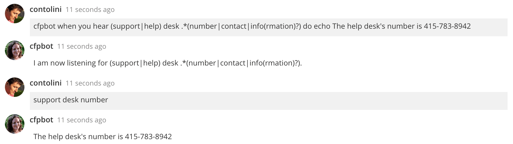

# hubot-eavesdrop [](https://travis-ci.org/catops/hubot-eavesdrop.svg?branch=master) [](https://www.npmjs.com/package/hubot-eavesdrop)

A hubot script to perform actions when user-specified keywords are mentioned. Based on [eardropping.coffee](https://github.com/github/hubot-scripts/blob/master/src/scripts/eardropping.coffee).

See [`src/eavesdrop.coffee`](src/eavesdrop.coffee) for full documentation.



## Installation

In hubot project repo, run:

`npm install hubot-eavesdrop --save`

Then add **hubot-eavesdrop** to your `external-scripts.json`:

```json
["hubot-eavesdrop"]
```

## Sample Interaction

```
user1>> hubot when you hear slow clap do echo http://i.imgur.com/0mKXcg1.gif
user1>> slow clap
hubot>> http://i.imgur.com/0mKXcg1.gif

user1>> hubot stop listening for slow clap
hubot>> Okay, I will ignore slow clap.
```

Also supports regular expressions.

```
user1>> hubot when you hear slow\s?clap(ping)? do echo http://i.imgur.com/0mKXcg1.gif
user1>> slow clapping
hubot>> http://i.imgur.com/0mKXcg1.gif
user1>> slowclap
hubot>> http://i.imgur.com/0mKXcg1.gif
```

Multiple actions can be specified for a single keyword.

```
user1>> hubot when you hear slow clap do 1|echo congrats!; 2|echo http://i.imgur.com/0mKXcg1.gif
user1>> slow clap
hubot>> congrats!
hubot>> http://i.imgur.com/0mKXcg1.gif
```

To reduce channel noise, keywords only trigger events once every thirty seconds.
The length of this delay can be changed by setting a `HUBOT_EAVESDROP_DELAY` environment variable.

----

## Open source licensing info
1. [TERMS](TERMS.md)
2. [LICENSE](LICENSE)
3. [CFPB Source Code Policy](https://github.com/cfpb/source-code-policy/)
